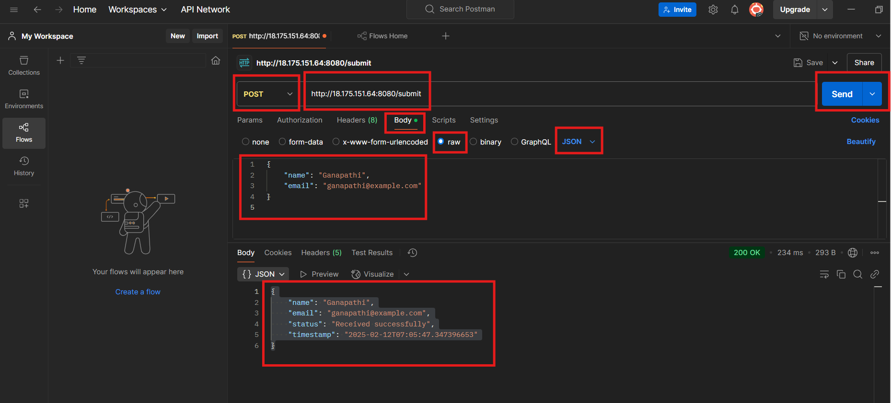

# Setting Up a Sample Spring Boot Application with Maven on Amazon Linux
- [GitHub Repository](https://github.com/kganapathi6008/hello-world-app2)

- This guide will walk you through the process of setting up a simple Spring Boot application using Maven on an Amazon Linux server. It includes installing dependencies, building the application, and running it.

---

## **1. Install Prerequisites**

Ensure your Amazon Linux server has the necessary tools installed.

### **Install Java (JDK 17)**
```sh
sudo yum install -y java-17-amazon-corretto-devel
```

### **Verify Java Installation**
```sh
java -version
```

Expected output:
```
openjdk version "17.0."
...
```

### **Install Maven**
- Once Java is installed, proceed with installing Maven. Maven is a Java tool, so you must have Java installed in order to proceed.
- Apache Maven is a Java build tool for programmers to compile, test and package the applications they build.
- Maven is written in Java and is used to build projects written in Java, Scala, Ruby, etc

```sh
cd /opt
sudo wget https://downloads.apache.org/maven/maven-3/3.9.6/binaries/apache-maven-3.9.6-bin.tar.gz
sudo tar -xvzf apache-maven-3.9.6-bin.tar.gz
sudo ln -s /opt/apache-maven-3.9.6 /opt/maven
```

### **Set Up Maven Environment Variables**
```sh
echo 'export M2_HOME=/opt/maven' | sudo tee -a /etc/profile.d/maven.sh
echo 'export PATH=$M2_HOME/bin:$PATH' | sudo tee -a /etc/profile.d/maven.sh
sudo chmod +x /etc/profile.d/maven.sh
source /etc/profile.d/maven.sh
```

### **Verify Maven Installation**
```sh
mvn -version
```
Expected output:
```
Apache Maven 3.9.6
...
```

---

## **2. Create a Sample Spring Boot Application**

### **Go to user home directory**
```sh
cd ~
```
### **Generate a Spring Boot Project**
```sh
mvn archetype:generate -DgroupId=com.example -DartifactId=hello-world -DarchetypeArtifactId=maven-archetype-quickstart -DinteractiveMode=false
```

### **Move into the Project Directory**
```sh
cd hello-world
ls -la           ## to see the list of files and folders
```

### **Modify `pom.xml` to Include Spring Boot Dependencies**
Edit `pom.xml` and replace its contents with the following:

```xml
<project xmlns="http://maven.apache.org/POM/4.0.0"
         xmlns:xsi="http://www.w3.org/2001/XMLSchema-instance"
         xsi:schemaLocation="http://maven.apache.org/POM/4.0.0 http://maven.apache.org/xsd/maven-4.0.0.xsd">
    <modelVersion>4.0.0</modelVersion>

    <groupId>com.example</groupId>
    <artifactId>hello-world</artifactId>
    <version>1.0-SNAPSHOT</version>
    <packaging>jar</packaging>

    <name>hello-world</name>
    <description>Spring Boot Hello World Application</description>

    <!-- Add Spring Boot Parent -->
    <parent>
        <groupId>org.springframework.boot</groupId>
        <artifactId>spring-boot-starter-parent</artifactId>
        <version>3.2.2</version>
        <relativePath/>
    </parent>

    <dependencies>
        <!-- Spring Boot Web Starter -->
        <dependency>
            <groupId>org.springframework.boot</groupId>
            <artifactId>spring-boot-starter-web</artifactId>
        </dependency>

        <!-- Spring Boot Starter Test (JUnit 5, AssertJ, MockMvc) -->
        <dependency>
            <groupId>org.springframework.boot</groupId>
            <artifactId>spring-boot-starter-test</artifactId>
            <scope>test</scope>
            <exclusions>
                <exclusion>
                    <groupId>org.junit.vintage</groupId>
                    <artifactId>junit-vintage-engine</artifactId>
                </exclusion>
            </exclusions>
        </dependency>

        <!-- JUnit 5 -->
        <dependency>
            <groupId>org.junit.jupiter</groupId>
            <artifactId>junit-jupiter-api</artifactId>
            <scope>test</scope>
        </dependency>
        <dependency>
            <groupId>org.junit.jupiter</groupId>
            <artifactId>junit-jupiter-engine</artifactId>
            <scope>test</scope>
        </dependency>

        <!-- AssertJ for better assertions -->
        <dependency>
            <groupId>org.assertj</groupId>
            <artifactId>assertj-core</artifactId>
            <scope>test</scope>
        </dependency>

        <!-- Spring Boot Test WebClient for integration tests -->
        <dependency>
            <groupId>org.springframework.boot</groupId>
            <artifactId>spring-boot-starter-webflux</artifactId>
            <scope>test</scope>
        </dependency>
    </dependencies>

    <build>
        <plugins>
            <plugin>
                <groupId>org.springframework.boot</groupId>
                <artifactId>spring-boot-maven-plugin</artifactId>
            </plugin>

            <plugin>
                <groupId>org.apache.maven.plugins</groupId>
                <artifactId>maven-compiler-plugin</artifactId>
                <version>3.8.1</version>
                <configuration>
                    <source>17</source>
                    <target>17</target>
                </configuration>
            </plugin>
        </plugins>
    </build>
</project>

```

---

## **3. Create the Main Application File**

### **Modify or Create `src/main/java/com/example/App.java`**
Edit the file and replace its contents with:

```java
package com.example;

import org.slf4j.Logger;
import org.slf4j.LoggerFactory;
import org.springframework.boot.SpringApplication;
import org.springframework.boot.autoconfigure.SpringBootApplication;
import org.springframework.web.bind.annotation.*;

import java.net.InetAddress;
import java.net.UnknownHostException;
import java.time.LocalDateTime;
import java.util.HashMap;
import java.util.Map;

@SpringBootApplication
public class App {
    public static void main(String[] args) {
        SpringApplication.run(App.class, args);
    }
}

@RestController
@RequestMapping("/")
class HelloController {
    private static final Logger logger = LoggerFactory.getLogger(HelloController.class);

    @GetMapping
    public Map<String, String> hello() throws UnknownHostException {
        logger.info("Received request for / endpoint");
        Map<String, String> response = new HashMap<>();
        response.put("message", "Hello, World from Spring Boot!");
        response.put("timestamp", LocalDateTime.now().toString());
        response.put("nodeIP", InetAddress.getLocalHost().getHostAddress());
        return response;
    }

    @GetMapping("/greet/{name}")
    public Map<String, String> greet(@PathVariable String name) throws UnknownHostException {
        logger.info("Greeting request for {}", name);
        Map<String, String> response = new HashMap<>();
        response.put("message", "Hello, " + name + "!");
        response.put("timestamp", LocalDateTime.now().toString());
        response.put("nodeIP", InetAddress.getLocalHost().getHostAddress());
        return response;
    }

    @PostMapping("/submit")
    public Map<String, Object> submit(@RequestBody User user) throws UnknownHostException {
        logger.info("Received user submission: {}", user);
        Map<String, Object> response = new HashMap<>();
        response.put("name", user.getName());
        response.put("email", user.getEmail());
        response.put("status", "Received successfully");
        response.put("timestamp", LocalDateTime.now().toString());
        response.put("nodeIP", InetAddress.getLocalHost().getHostAddress());
        return response;
    }

    @GetMapping("/status")
    public Map<String, String> status() throws UnknownHostException {
        logger.info("Checking application status");
        Map<String, String> response = new HashMap<>();
        response.put("status", "Application is running fine!");
        response.put("timestamp", LocalDateTime.now().toString());
        response.put("nodeIP", InetAddress.getLocalHost().getHostAddress());
        return response;
    }
}

class User {
    private String name;
    private String email;

    // Getters and Setters
    public String getName() {
        return name;
    }

    public void setName(String name) {
        this.name = name;
    }

    public String getEmail() {
        return email;
    }

    public void setEmail(String email) {
        this.email = email;
    }
}
```

---

## **4. Create the Sample Test Case**

### **Modify or Create `src/test/java/com/example/AppTest.java`**
Edit the file and replace its contents with:

```java
package com.example;

import static org.assertj.core.api.Assertions.assertThat;

import org.junit.jupiter.api.Test;
import org.springframework.boot.test.context.SpringBootTest;
import org.springframework.beans.factory.annotation.Autowired;
import org.springframework.boot.test.web.client.TestRestTemplate;
import org.springframework.boot.test.web.server.LocalServerPort;
import org.springframework.http.ResponseEntity;
import java.util.Map;

@SpringBootTest(webEnvironment = SpringBootTest.WebEnvironment.RANDOM_PORT)
class AppTest {

    @LocalServerPort
    private int port;

    @Autowired
    private TestRestTemplate restTemplate;

    @Test
    void contextLoads() {
        assertThat(restTemplate).isNotNull();
    }

    @Test
    void helloEndpointShouldReturnJson() {
        ResponseEntity<Map> response = restTemplate.getForEntity("http://localhost:" + port + "/", Map.class);
        assertThat(response.getBody()).containsKeys("message", "timestamp", "nodeIP");
    }

    @Test
    void greetEndpointShouldReturnJson() {
        ResponseEntity<Map> response = restTemplate.getForEntity("http://localhost:" + port + "/greet/Ganapathi", Map.class);
        assertThat(response.getBody()).containsKeys("message", "timestamp", "nodeIP");
    }

    @Test
    void submitEndpointShouldReturnJson() {
        User user = new User();
        user.setName("Ganapathi");
        user.setEmail("ganapathi@example.com");

        ResponseEntity<Map> response = restTemplate.postForEntity("http://localhost:" + port + "/submit", user, Map.class);
        assertThat(response.getBody()).containsKeys("name", "email", "status", "timestamp", "nodeIP");
    }

    @Test
    void statusEndpointShouldReturnJson() {
        ResponseEntity<Map> response = restTemplate.getForEntity("http://localhost:" + port + "/status", Map.class);
        assertThat(response.getBody()).containsKeys("status", "timestamp", "nodeIP");
    }
}
```
---

## **5. Build and Run the Application**

### **Rebuild and run tests**
```
mvn test
```

### **To package the app while running tests**
```
mvn clean package
```

### **Maven clean to remove old compiled files**
```
mvn clean
```

### **Build the Package while skipping tests**
```sh
mvn clean package -Dmaven.test.skip=true
```

### **Run the Application**
```sh
java -jar target/hello-world-1.0-SNAPSHOT.jar
```

### **Runs the app directly from source without needing a JAR**
```
mvn spring-boot:run
```
---

## **6.Access the Application**

### Security Group Inbound Rules
To access the application, you need to configure the security group inbound rules on your AWS EC2 instance. Follow these steps:

1. Go to the **AWS EC2 Dashboard**.
2. Select your **EC2 instance**.
3. Navigate to the **Security** tab and click on the attached **Security Group**.
4. Under the **Inbound rules** section, click **Edit inbound rules**.
5. Add a new rule with the following details:
   - **Type:** HTTP
   - **Protocol:** TCP
   - **Port Range:** 8080
   - **Source:** Anywhere (0.0.0.0/0) or restrict it to your IP for security.
6. Save the changes.

Once these rules are set, you can access your Spring Boot application through the browser or via `curl` commands.

### Using Command Line and Expected JSON Output

#### 1. `curl http://localhost:8080/`
```json
{
    "message": "Hello, World from Spring Boot!",
    "timestamp": "2025-02-12T05:14:55.938126472"
}
```

#### 2. `curl http://localhost:8080/greet/Ganapathi`
```json
{
    "message": "Hello, Ganapathi!",
    "timestamp": "2025-02-12T05:15:01.123456789"
}
```
#### 3. `curl http://localhost:8080/status`
```json
{
    "status": "Application is running fine!",
    "timestamp": "2025-02-12T05:16:00.987654321"
}
```

#### 4. `curl -X POST -H "Content-Type: application/json" -d '{"name":"Ganapathi", "email":"ganapathi@example.com"}' http://localhost:8080/submit`
```json
{
    "name": "Ganapathi",
    "email": "ganapathi@example.com",
    "status": "Received successfully",
    "timestamp": "2025-02-12T05:15:10.678910111"
}
```

### Sending Requests Using a Browser

#### 1. Using Postman (Recommended)
- Open **Postman**.
- Set the method to **POST**.
- Enter the URL: `http://<Server.IP>:8080/submit`.
- Go to the **Body** tab → Select **raw** → Choose **JSON**.
- Enter the request body:
  ```json
  {
      "name": "Ganapathi",
      "email": "ganapathi@example.com"
  }
  ```
- Click **Send**.
- Expected Output
  ```json
  {
      "name": "Ganapathi",
      "email": "ganapathi@example.com",
      "status": "Received successfully",
      "timestamp": "2025-02-12T07:05:47347396653"
  }
  ```

#### 2. Adding a Screenshot


---

## **7.Troubleshooting**

### **Issue: Port 8080 Already in Use**
Run the following command to find and kill the process using port 8080:
```sh
sudo netstat -tulnp | grep :8080
sudo kill -9 <PID>
```
Then restart your application.

---

## **8. Conclusion**
You have successfully set up a Spring Boot application on Amazon Linux, built it using Maven, and deployed it to be accessible via a web browser. 🚀

