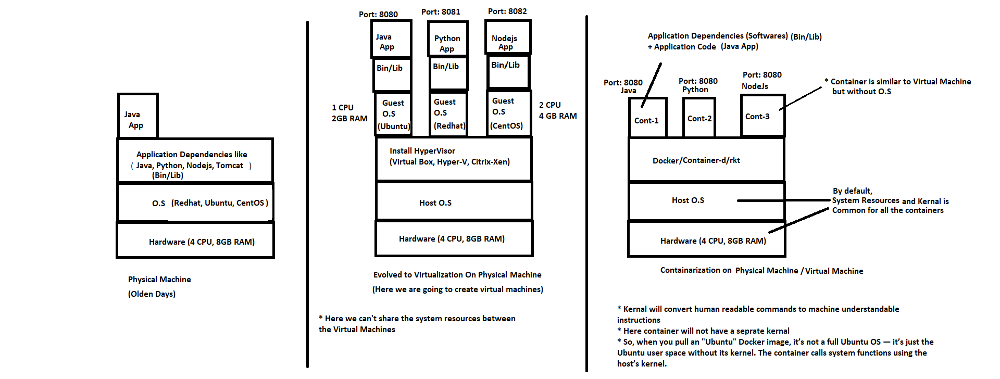
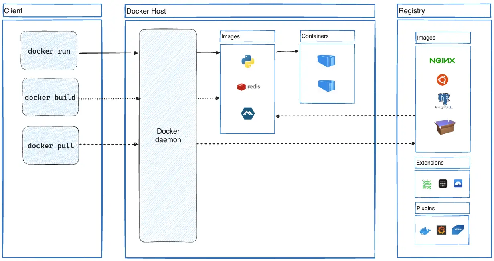
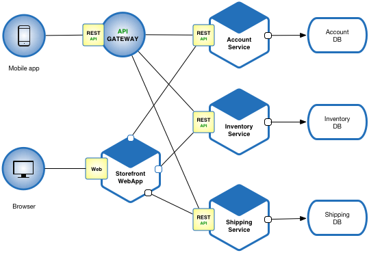

# Docker

## Introduction
In modern software development, the need to run multiple operating systems (OS) on a single machine led to the creation of **Virtual Machines (VMs)**. However, VMs come with certain limitations, such as being resource-heavy and slow to bootstrap. This is where **Docker** and **containerization** come into play. Let's break it down step by step.

---

## 1. Why Do We Need Docker?

### The Problem with Traditional Virtual Machines
- In a single machine, running multiple operating systems was made possible by **Virtual Machines (VMs)**.
- A **Virtual Machine (VM)** contains:
  - **Guest Operating System**
  - Libraries and Binaries
  - Application Files
- When deploying applications on EC2 instances (or other cloud VMs):
  - You have to select an **AMI (Amazon Machine Image)**.
  - Define **capacity** (CPU, RAM, etc.).
  - Configure **Networking** (VPC, Subnets, Security Groups, Public IP).
  - Allocate **Static Memory**.

### Inefficiencies of VMs
- If your application uses only **100MB RAM**, but the minimum available instance type has **1GB RAM**, you are forced to over-allocate resources.
- **Boot time:** Starting a VM takes about **2-3 minutes**.
- **Autoscaling:** When VMs are used in autoscaling, spinning up new instances takes time (2-3 minutes per instance), slowing down the ability to quickly replicate services.
- **Complex networking:** Explicit configurations are needed for VPC, subnets, security groups, and public IPs.

---

## 2. The Need for a Lightweight Solution
To solve these problems, we need:
- **Lightweight images**
- **Dynamic memory allocation**
- **Faster bootstrap times** (start containers in seconds)
- **Simpler networking**

---

## 3. Virtualization vs. Containerization
### Virtualization (VMs)
- Virtualizes **hardware**.
- Each VM has its own **Guest OS**.
- Heavyweight and slow to start.
- Example: Running multiple EC2 instances, each with its own OS.

### Containerization
- Virtualizes the **Operating System** (OS-level virtualization).
- No Guest OS — shares the Host OS kernel.
- Only contains necessary **binaries, libraries, and application code**.
- Lightweight and starts in **seconds**.
- Provides process-level isolation.



---

## 4. Introduction to Docker
Docker is a popular **containerization platform** that solves the inefficiencies of VMs by enabling lightweight, portable, and fast containers.

---

## 5. Docker Architecture
Docker uses a **Client-Server Architecture**:


1. **Docker Client**
   - Interacts with the Docker Daemon.
   - Runs `docker` commands (e.g., `docker run`, `docker build`).

2. **Docker Host (Daemon)**
   - Runs the Docker engine.
   - Manages images, containers, networks, and volumes.

3. **Docker Registry**
   - Stores Docker images.
   - Public registry: **Docker Hub**.
   - Private registries can also be set up. [DTR, Nexus, Jfrog, ECR, ACR, GAR]

4. **Dockerfile**
   - A text file with instructions to build Docker images.
   - Defines the base image, app dependencies, and startup commands.

5. **Docker Images**
   - It is a Package which contains everything to run the application or containers.
   - Read-only templates to create containers.
   - Example: An image containing a Java runtime, Spring Boot app, and necessary dependencies.

6. **Docker Containers**
   - It is a Runtime process of Docker Image.
   - Lightweight, runnable instances of Docker images.
   - Start, stop, and replicate in **seconds**.


---

## 6. Why Docker over VMs?
| Feature              | Virtual Machines (VMs)       | Docker Containers        |
|----------------------|----------------------------- |-------------------------|
| **OS**               | Guest OS for each VM         | Shares host OS kernel   |
| **Boot Time**        | Minutes                      | Seconds                 |
| **Size**             | GBs (includes OS)            | MBs (only app + deps)   |
| **Resource Allocation** | Static                    | Dynamic                 |
| **Networking**       | Complex                      | Simple                  |

---

## 7. Practical Use Case: Microservices
### What are Microservices?
Microservices are an architectural style where an application is divided into small, independent services. Each service runs in its own container.

### Example:
- **Account Service**: Manages user accounts.
- **Inventory Service**: Manages product inventory.
- **Shipping Service**: Manages order shipping.



### Benefits:
- **Loosely Coupled**: Each service can be developed, deployed, and scaled independently.
- **Fault Isolation**: Failure in one service does not affect others.
- **Scalability**: Individual services can be scaled based on demand.

---

## 8. Creating an EC2 Instance with Docker
When creating an EC2 instance:
1. **Select AMI**: Choose a lightweight AMI (Amazon Machine Image).
2. **Capacity**: Allocate resources dynamically.
3. **Networking**: Configure VPC, subnets, and security groups.
4. **Install Docker**: On top of the EC2 instance, install Docker to run containers.

### Why Use Docker on EC2?
- Avoid the overhead of a Guest OS.
- Faster deployment and scaling of applications.

---

## 9. Summary
- **VMs** are heavyweight and slow to bootstrap.
- **Containers** are lightweight, fast, and efficient.
- **Docker** is the leading platform for containerization.
- **Microservices** benefit greatly from containerization.
- Use Docker on EC2 for efficient resource utilization and faster scaling.

---

## Additional Resources
- [Docker Documentation](https://docs.docker.com/)

---
---
---
# Docker Installation on Amazon Linux 2

This guide provides step-by-step instructions for installing Docker on an Amazon Linux 2 EC2 instance.

## Prerequisites
- An Amazon Linux 2 EC2 instance.
- SSH access to the instance.
- Sudo privileges.

## Steps to Install Docker

### 1. Connect to the EC2 Instance
Use SSH to connect to your Amazon Linux 2 instance:
```sh
ssh ec2-user@<ec2-ip-address-dns-name-here>
```

### 2. Update the System Packages
Before installing Docker, update the existing packages:
```sh
sudo yum update -y
```

### 3. Search for Docker Package (Optional)
To check if Docker is available in the repository, run:
```sh
sudo yum search docker
```

To get more information about the Docker package:
```sh
sudo yum info docker
```

### 4. Install Docker
Run the following command to install Docker:
```sh
sudo yum install docker -y
```

### 5. Enable Docker to Start on Boot
Enable the Docker service so it starts automatically upon system reboot:
```sh
sudo systemctl enable docker.service
```

### 6. Start the Docker Service
Start the Docker service manually:
```sh
sudo systemctl start docker.service
```

### 7. Verify Docker Status
Check if Docker is running properly:
```sh
sudo systemctl status docker.service
```

### 8. Add User to Docker Group
By default, Docker requires root or sudo privileges. To allow the `ec2-user` to run Docker commands without `sudo`, add the user to the `docker` group:
```sh
sudo usermod -a -G docker ec2-user
```

### 9. Logout and Login Again
For the changes to take effect, log out and log back into the instance:
```sh
exit
```
Then reconnect using SSH:
```sh
ssh ec2-user@<ec2-ip-address-dns-name-here>
```

### 10. Apply Group Changes Without Logging Out
Instead of logging out and logging back in, you can apply the group changes immediately using:
```sh
newgrp docker
```
This will start a new shell session with the updated group permissions.

### 11. Verify Docker Access
Run the following command to check if you can use Docker without `sudo`:
```sh
docker ps
```
If the command runs successfully without requiring `sudo`, the setup is complete.


```sh
docker version
```
```sh
docker info
```
To test Docker, run the `hello-world` container:
```sh
docker run hello-world
```

---
---
---

## Docker Home Directory
When you install Docker on an Linux server, Docker stores all its data in:

```
/var/lib/docker
```
This directory contains images, containers, volumes, and networking information.

### Key Directories in /var/lib/docker
- /var/lib/docker/containers/ → Stores container runtime data (logs, metadata).
- /var/lib/docker/image/ → Stores Docker images.
- /var/lib/docker/volumes/ → Stores Docker volumes for persistent storage.
- /var/lib/docker/network/ → Stores networking-related data.
- /var/lib/docker/tmp/ → Temporary Docker files.
Check Docker's Storage Location

To verify Docker’s home directory, run:
```
docker info | grep "Docker Root Dir"
```
It should return:

```
Docker Root Dir: /var/lib/docker
```
