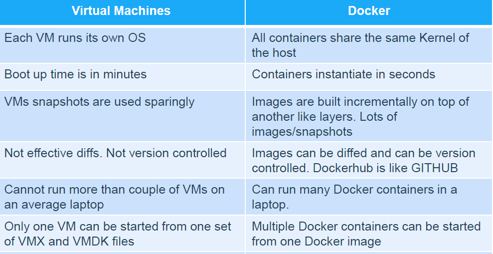

# Virtualization vs Containerization
- https://aws.amazon.com/compare/the-difference-between-containers-and-virtual-machines/
- https://www.atlassian.com/microservices/cloud-computing/containers-vs-vms
- https://dockerlabs.collabnix.com/beginners/difference-vm-containers.html

## Kernel and Operating System (OS)

### What is an Operating System (OS)?
An **Operating System (OS)** is system software that manages hardware and software resources on a computer. It provides a user interface and manages:
- **Process management** (running programs)
- **Memory management** (allocating RAM to programs)
- **File system** (handling file storage and retrieval)
- **Device management** (interfacing with hardware like disks and network cards)
- **Security and permissions**

Examples of OS: Linux, Windows, macOS, etc.

### What is a Kernel?
The **kernel** is the core part of an OS. It operates at a lower level and directly interacts with the hardware. The kernel:
- Manages **system resources** (CPU, memory, I/O devices)
- Provides **system calls** so applications can request hardware resources
- Ensures **process isolation** and controls access to hardware

#### Types of Kernels
1. **Monolithic Kernel**: All OS services (file system, memory, drivers) run in kernel space (e.g., Linux kernel).
2. **Microkernel**: Minimal kernel functions, with most services running in user space (e.g., Minix, QNX).

### Kernel vs OS
- The **OS** includes the **kernel** plus user-level applications (shell, libraries, etc.).
- The **kernel** is just the core component that manages hardware directly.

#### Example:
- In **Linux**, the kernel (`vmlinuz`) manages hardware, while the user space contains shells (bash), package managers (apt, yum), and user apps.

### Graphical Representation
```
+------------------------+
|    Applications        |  <-- User programs (browsers, editors)
+------------------------+
|    Operating System    |  <-- Manages hardware and apps (shell, services)
+------------------------+
|        Kernel          |  <-- Core of OS (manages CPU, memory, I/O)
+------------------------+
|       Hardware         |  <-- Physical components (CPU, RAM, disks)
+------------------------+
```

---

## Virtualization

### What is Virtualization?
Virtualization is the process of creating multiple virtual instances (Virtual Machines or VMs) on a single physical machine. This is done using software called a **hypervisor**.

### Components of Virtualization
1. **Physical Machine (Host)**: The actual hardware — a physical server or computer.
2. **Hypervisor**: Software that allows the creation and management of VMs by abstracting hardware resources.
3. **Virtual Machines (VMs)**: Each VM has:
   - **Guest Operating System** (like Ubuntu, Windows, or Red Hat)
   - **Libraries and binaries**
   - **Application files**

### How Virtualization Works
- The hypervisor sits between the physical hardware and the VMs.
- It allocates CPU, memory, storage, and network resources to each VM.
- Each VM is **isolated** — so a crash or issue in one VM doesn’t affect others.

### Example: AWS EC2
- When you create an **EC2 instance**, you are launching a **VM on top of AWS's physical servers**.
- The physical server uses a hypervisor to run multiple VMs (EC2 instances), each with its own OS.
- Your EC2 instance contains only **one OS** — but the underlying physical machine can host multiple VMs with different OSes.

---
## Containerization

### What is Containerization?
Containerization is a lightweight alternative to virtualization where applications are packaged with their dependencies but **share the same OS kernel**.

### Components of Containerization
1. **Host OS**: The main operating system (like Linux or Windows).
2. **Container Runtime**: Software like Docker or containerd that runs containers.
3. **Containers**: Each container includes:
   - Application code
   - Libraries and dependencies
   - User space from a base image (like Ubuntu, Red Hat, etc.)
- **No Guest OS** — all containers share the same OS kernel.

### Understanding "No Guest OS"
- Unlike VMs, containers **do not have their own kernel**.
- When you use a container with a base image like Ubuntu or Red Hat, it only contains the **user space** (tools, libraries, and binaries) — not the kernel.
- The kernel calls are handled by the **host OS kernel**.

#### Example:
- If your EC2 instance uses **Amazon Linux** and you run an **Ubuntu container**, the Ubuntu container uses the **Amazon Linux kernel** — not its own kernel.
- The Ubuntu base image only brings in user-level tools (like apt, bash, etc.), but it still relies on the host’s kernel for system operations.

This is why we say **containers don’t have a guest OS** — they don’t have their own kernel, just the user space.

### How Containerization Works
- Containers share the host OS kernel but remain **isolated** from each other using namespaces and cgroups.
- They are faster and more lightweight compared to VMs since there is no need to boot a full OS.

### Example: Docker
- If you run 3 Docker containers on an EC2 instance, they all share the EC2's OS kernel.
- Each container might have different libraries and apps, and they may use different user spaces from base images like Ubuntu or Red Hat. However, they don’t have their own OS kernel — all containers share the host OS kernel.


## Key Differences

| Feature            | Virtual Machines (VMs)        | Containers                  |
|--------------------|------------------------------|----------------------------|
| OS                 | Each VM has its own OS (kernel + user space) | Shared host OS kernel, own user space (from base images like Ubuntu or Red Hat) |
| Kernel             | Each VM has its own kernel   | Uses the host OS kernel    |
| Startup Time       | Minutes (boot time for OS)   | Seconds (process startup)  |
| Isolation          | Full hardware-level isolation| Process-level isolation    |
| Size               | Large (GBs, due to OS)       | Lightweight (MBs)          |
| Use Case           | Running multiple OSes        | Running multiple apps on 1 OS |

---
---
[Difference between Containers and Virtual Machines
](https://dockerlabs.collabnix.com/beginners/difference-vm-containers.html)


## Conclusion
- **Use VMs** when you need to run different OSes or fully isolate environments.
- **Use containers** when you want fast, portable, and resource-efficient app deployment.


