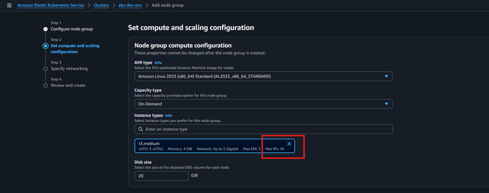

# Steps to Configure AWS EKS Cluster
- https://docs.aws.amazon.com/eks/latest/userguide/create-cluster.html

## **Step 1: Create IAM Roles**
### 1. EKS Cluster Role (`eks_cluster_role`)

* Go to IAM → Create Role
* **Trusted entity type**: AWS Service
* **Use case**: EKS → EKS - Cluster
* **Permissions policy**: Attach the policy `AmazonEKSClusterPolicy`
* **Name** the role `eks_cluster_role`

### 2. EKS Node Role (`eks_node_role`)

* Go to IAM → Create Role
* **Trusted entity type**: AWS Service
* **Use case**: EC2
* **Permissions policies**: Attach the following:

  * `AmazonEKSWorkerNodePolicy`
  * `AmazonEC2ContainerRegistryReadOnly`
  * `AmazonEKS_CNI_Policy`
* **Name** the role `eks_node_role`

## **Step 2: Create an EKS Cluster**
### Step 1: Cluster

* **Name**: eks-dev-env
* **Kubernetes version**: 1.34
* **EKS Auto Mode**: Disabled
* **Upgrade policy**: Standard
* **Cluster IAM role**: `arn:aws:iam::111111111111:role/eks_cluster_role`
* **Kubernetes cluster administrator access**: Allow cluster administrator access
* **Authentication mode**: EKS API and ConfigMap

### Step 2: Networking

`Note`: Create an Amazon VPC for your Amazon EKS cluster using CloudFormation - https://docs.aws.amazon.com/eks/latest/userguide/creating-a-vpc.html

* **VPC**: Default VPC
* **Cluster IP address family**: IPv4
* **Subnets**: All subnets selected

**Cluster endpoint access**:

* **API server endpoint access**: Public
* **Public access source allowlist**: `0.0.0.0/0`

### Step 3: Observability

* **Control plane logs**:

  * API server: Off
  * Audit: Off
  * Authenticator: Off
  * Controller manager: Off
  * Scheduler: Off

### Step 4: Add-ons

* `CoreDNS` – Provides DNS resolution inside the cluster; it lets pods find and communicate with each other using service names instead of IPs.
* `kube-proxy` – Manages network rules on each worker node to route traffic to the correct pod; ensures Services work properly.
* `Amazon VPC CNI` – Integrates Kubernetes pods directly with the AWS VPC network, giving each pod a real VPC IP address and native AWS networking performance.

## **Step 3: Create a Node Group**
### Step 1: Node group

* **Name**: eks-dev-env-ng
* **Node IAM role**: `arn:aws:iam::111111111111:role/eks_node_role`

### Step 2: Compute and Scaling Configuration

* **Capacity type**: On-Demand
* **AMI type**: Amazon Linux 2023 (x86_64) Standard (AL2023_x86_64_STANDARD)
* **Instance types**: `t3.medium`
* **Disk size**: 20 GiB

**Scaling configuration**:

* **Desired size**: 1 node
* **Minimum size**: 1 node
* **Maximum size**: 3 nodes

**Update configuration**:

* **Maximum unavailable**: 1 node
* **Update strategy**: Default

### Step 3: Networking

* **Subnets**: All subnets of default VPC selected
* **Configure remote access to nodes**: Off


## **Step 4: Configure kubectl to Connect to EKS**
1. Install or update the AWS CLI.
2. Run the following command to update your kubeconfig:
   ```sh
   aws eks update-kubeconfig --region <your-region> --name <your-cluster-name>
   ```
   By default, the kubeconfig file is saved at:
   ```sh
   ~/.kube/config
   ```
3. Verify the connection:
   ```sh
   kubectl get nodes
   ```

## **Step 5: Deploy Applications in the Default Namespace**
1. Create a sample deployment using `kubectl`:
   ```sh
   kubectl create deployment my-app --image=nginx
   ```
2. Verify the deployment:
   ```sh
   kubectl get pods
   ```
3. Expose the deployment with a service:
   ```sh
   kubectl expose deployment my-app --type=LoadBalancer --port=80
   ```
4. Retrieve the external IP:
   ```sh
   kubectl get services
   ```

Your AWS EKS cluster is now configured in the default namespace, and you can deploy applications as needed.

---

## **Basic `kubectl` Commands for EKS Cluster**

### **1. Check Available Namespaces**
```sh
kubectl get ns
```
_Output:_
```
NAME              STATUS   AGE
default           Active   6d5h
kube-node-lease   Active   6d5h
kube-public       Active   6d5h
kube-system       Active   6d5h
```

### **2. List All Nodes in the Cluster**
```sh
kubectl get nodes
```

### **3. List All Pods in the Cluster (Across All Namespaces)**
```sh
kubectl get pods --all-namespaces
```

### **4. Get Details of a Specific Pod**
```sh
kubectl describe pod <pod-name>
```

### **5. Check the Status of Deployments**
```sh
kubectl get deployments
```

### **6. View the Services Running in the Cluster**
```sh
kubectl get services
```

### **7. Delete a Deployment**
```sh
kubectl delete deployment <deployment-name>
```

### **8. Delete a Service**
```sh
kubectl delete service <service-name>
```

### **9. Scale a Deployment**
```sh
kubectl scale deployment <deployment-name> --replicas=3
```

---
---
---

---

## Pod Scheduling Limitation Based on Instance Type
- https://docs.aws.amazon.com/eks/latest/userguide/choosing-instance-type.html

### Instance: t2.micro

* **vCPU**: 1
* **Memory**: 1 GiB
* **Max ENIs**: 2
* **Max IPs per ENI**: 2
* **Total Max IP's**: 4
* **Total Max pods**: 4 - 1 = 3    ## Total Max pods = Total Max IP's - 1 ( The one IP is the instance IP, which is already allocated when the instance is created.)

### Instance: t3.medium


* **vCPU**: 2
* **Memory**: 4 GiB
* **Max ENIs**: 3
* **Max IPs per ENI**: 6
* **Total Max IP's**: 18
* **Total Max pods**: 18 - 1 = 17


### Explanation:

* When a `t2.micro` instance is used in the EKS node group, it supports only 4 IP addresses (pods).
* Some pods are automatically scheduled in the `kube-system` namespace:

  ```bash
  kubectl get pods -n kube-system -o wide
  ```
* Example output:

  * `aws-node`
  * `coredns` x2
  * `kube-proxy`
* These consume the available IPs.

### Result:

* If user deploys an additional application (e.g., `nginx`), it stays in `Pending` state:

  ```bash
  kubectl get pods
  NAME                     READY   STATUS    RESTARTS   AGE
  nginx-xxxxx              0/1     Pending   0          19m
  ```
* This happens because no additional IPs are available on the node.
* So, we can't use `t2.micro` for our EKS cluster worker nodes. Minimum, we have to use `t3.small` and `t3.medium`

### Confirm Max Pods Per Node Using CLI

Run the following command to check how many pods a node can host:

```bash
kubectl get node <node-name> -o json | jq '.status.allocatable.pods'
```

Example outputs:

```bash
$ kubectl get node ip-172-31-26-39.eu-west-2.compute.internal -o json | jq '.status.allocatable.pods'
"4"

$ kubectl get node ip-172-31-23-118.eu-west-2.compute.internal -o json | jq '.status.allocatable.pods'
"17"
```

This value confirms how many pods (IP addresses) the instance can support.

---

### Conclusion

* Choose instance types carefully based on expected pod count.
* t3.medium offers better pod density and is suitable for small production or dev environments.
* You can also increase max pods per node by customizing ENI configs or using custom networking, but it requires advanced setup.

---
---
---