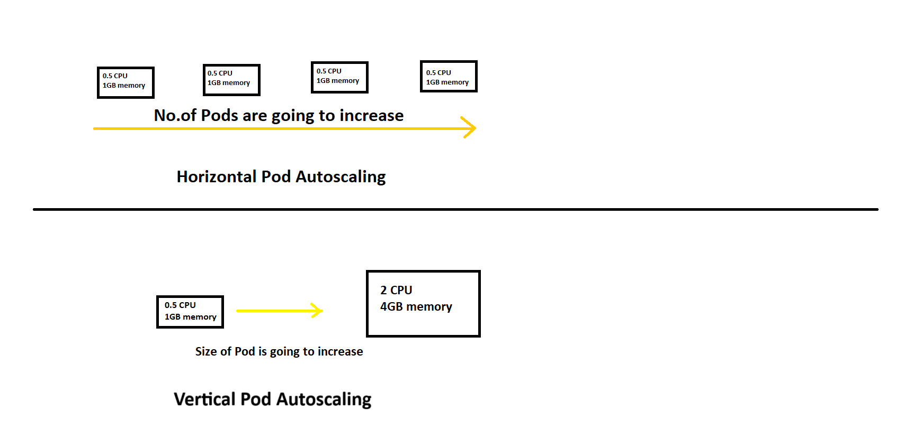

# Kubernetes Pod Autoscaling Overview

In Kubernetes, Pod Autoscaling is a mechanism that automatically adjusts the number of running pod replicas or the resource limits of pods based on their CPU, memory usage, or other custom metrics. This allows applications to scale efficiently based on demand.

---

## Types of Pod Autoscaling



1. **Horizontal Pod Autoscaler (HPA)**

   * Automatically scales the number of pod replicas in a deployment, replication controller, or stateful set based on observed CPU utilization or custom metrics.
   * HPA will interact with `Metrics server` to identify CPU/Memory utilization of pod.
2. **Vertical Pod Autoscaler (VPA)**

   * Automatically adjusts the CPU and memory resource requests and/or limits for containers in pods.
   * It can either suggest, automatically update, or require manual approval depending on the update mode.

      **a. Off Mode (Recommendation Mode)**

        * VPA only **gives recommendations**.
        * It does **not** change pod resource requests automatically.

      **b. Auto Mode**

        * VPA **automatically updates** CPU/memory requests for running pods.
        * It may recreate pods to apply updated resources.
        * VPA Auto mode may restart pods → impact on:
          * Stateful apps
          * Single pods
          * Non-HA workloads
        * Auto mode is not good for production without pod disruption budgets (PDBs).

      **c. Initial Mode**

        * VPA sets resource requests **only when the pod is first created**.
        * After that, it **does not** make changes.

---
## Resource Requests and Limits in Kubernetes

### Requests
* Requests are the minimum amount of CPU/Memory Kubernetes guarantees for a container.
* The scheduler uses these values to decide which node the Pod can fit on.

### Limits
* Limits define the maximum amount of CPU/Memory a container is allowed to consume.
* If the container exceeds limits, CPU is throttled and memory overuse kills the container (OOMKill).

### You can set these as:

```yaml
resources:
  requests:
    cpu: "0.5"
    memory: "1Gi"
  limits:
    cpu: "1"
    memory: "2Gi"
```

These are **container-level** configurations.

> Note: Requests define the minimum guaranteed resources. Limits define the maximum usable resources.

### Can Limits < Requests?

No. Kubernetes will throw an error during deployment. Limits must be >= requests.

  ```yaml
  resources:
    requests:
      cpu: "0.5"
      memory: "1Gi"
    limits:
      cpu: "0.5"
      memory: "1Gi"
  ```

---
## Importance of Setting Resource Requests and Limits

### **1. When Limits Are Not Set**
If resource limits and requests are **not** set:

* Kubernetes will not have a reference to schedule or throttle pod resource usage.
* A misbehaving pod can consume all CPU/memory on a node, impacting other pods (resource starvation).

### **2. When Limits Are Set**

#### **a. If CPU Exceeds the Limit**

* The pod is **throttled**.
* The application's performance slows down because Kubernetes restricts how much CPU time the container can use.
* CPU is a **compressible resource**, so the OS can reduce CPU allocation without killing the container.

#### **b. If Memory Exceeds the Limit**

* The pod is **evicted** (OOMKilled - Out Of Memory Killed).
* Memory cannot be throttled — once memory is requested, the OS must provide it fully.
* Since memory is **non-compressible**, the kernel kills the container to protect the node from running out of RAM.

### Key Difference

| Resource   | Can it be throttled? | What happens if exceeded?      |
| ---------- | -------------------- | ------------------------------ |
| **CPU**    | Yes                  | Pod is throttled (runs slower) |
| **Memory** | No                   | Pod is evicted (OOMKilled)     |

### Summary

* **CPU**: Exceeding limit → **Throttling** → Slower performance
* **Memory**: Exceeding limit → **Evicted** → Container terminated
---
## **Throttling vs Eviction**

### **Throttling (CPU)**

* Happens when a container exceeds its **CPU limit** — this is called **CPU throttling**.
* Kubernetes slows down the container using the Linux CFS scheduler.
* The pod continues running, but with reduced performance.
* Applies **only to CPU** because CPU is a compressible resource.

### **Eviction (Memory/Node Pressure)**

* Happens when the **node runs low on resources** like Memory, Disk, or PIDs.
* Kubernetes evicts (removes) the pod from the node to protect node stability.
* The pod is terminated (OOMKilled) and may be rescheduled on another node.
* Memory cannot be throttled, so eviction prevents the system from running out of RAM.
* Kubernetes may evict pods even when they don’t exceed limits, it possible due to:
  * MemoryPressure
  * DiskPressure
  * PIDPressure

---

## Scaling Considerations

A Deployment starts with a fixed number of pods. When the traffic or load increases, Kubernetes can scale in two different ways:

1. **HPA – Horizontal Pod Autoscaler**
    * HPA adds more pods when CPU/Memory usage goes up.
    * Instead of making one pod bigger, it creates more copies of the pod.
    * Best for apps where more pods = more capacity (like web servers and APIs).

2. **VPA – Vertical Pod Autoscaler**
    * VPA increases the CPU/Memory size of each pod.
    * Instead of adding more pods, it makes the existing pods stronger.
    * Best for workloads that cannot scale by adding pods (batch jobs, ML jobs, heavy processing).

### ⚠️ Important Note:
* Do not use HPA and VPA together for CPU scaling unless VPA is in `Off Mode (Recommendation Mode)`, because otherwise both will try to adjust CPU at the same time and cause conflicts.

---

## Metrics Server

The **metrics-server** collects resource metrics (CPU/Memory) from Kubelets and exposes them through the Metrics API.

* HPA and VPA use this data to make scaling decisions.
* You can view metrics using:

  ```bash
  kubectl top nodes
  kubectl top pods
  ```
* The metrics server requires proper **RBAC** permissions.

By default, Kubernetes doesn’t include a metrics server — you must install it manually.

---
## Metrics Server Releases:
* Releases: https://github.com/kubernetes-sigs/metrics-server/releases
* Install using the kubectl command:
  ```bash
  kubectl apply -f https://github.com/kubernetes-sigs/metrics-server/releases/latest/download/components.yaml
  ```
* https://repost.aws/knowledge-center/eks-metrics-server-pod-autoscaler
* https://artifacthub.io/packages/helm/metrics-server/metrics-server

  ```bash
  helm repo add metrics-server https://kubernetes-sigs.github.io/metrics-server/
  helm upgrade --install metrics-server metrics-server/metrics-server
  ```
* Go to EKS Cluster add this add-on: `Metrics Server`

---
---
---

# Horizontal Pod Autoscaler (HPA)
---

## 1. What is HPA?

HPA (Horizontal Pod Autoscaler) automatically **increases or decreases the number of pod replicas** in a Deployment, ReplicaSet, or StatefulSet **based on metrics like CPU, memory, custom metrics, or external metrics**.

HPA **does NOT change pod size**; it only changes how many pods run.

---

## 2. HPA Metrics (Types of Metrics)

HPA supports **three metric types**.

### **1. Resource Metrics (Default)**

* CPU / Memory usage of Pods.
* Comes from **Metrics Server**.
* Most common in day‑to‑day deployments.

### **2. Custom Metrics**

Examples:

* Requests/sec
* Queue length
* Latency

Requires:

* **Kubernetes Custom Metrics API**
* **Prometheus Adapter** (most common)

### **3. External Metrics**

Used for metrics **outside Kubernetes**:

* AWS SQS Queue length
* Kafka lag
* Google Pub/Sub backlog

Requires:

* **External Metrics Adapter**

**Conclusion:**
HPA is **not limited** to CPU and memory.

---

## 3. Example Deployment (php-apache)
 - https://kubernetes.io/docs/tasks/run-application/horizontal-pod-autoscale-walkthrough/

A sample deployment with CPU request/limit defined.

```yaml
apiVersion: apps/v1
kind: Deployment
metadata:
  name: php-apache
spec:
  selector:
    matchLabels:
      run: php-apache
  template:
    metadata:
      labels:
        run: php-apache
    spec:
      containers:
      - name: php-apache
        image: registry.k8s.io/hpa-example
        ports:
        - containerPort: 80
        resources:
          requests:
            cpu: 200m
            memory: "256Mi"
          limits:
            cpu: 500m
            memory: "512Mi"

---
apiVersion: v1
kind: Service
metadata:
  name: php-apache
spec:
  ports:
  - port: 80
  selector:
    run: php-apache
```

Apply:

```
kubectl apply -f php-apache-deployment.yaml
```

---

## 4. Creating the HPA

### **YAML Example**

```yaml
apiVersion: autoscaling/v2
kind: HorizontalPodAutoscaler
metadata:
  name: php-apache-hpa
spec:
  scaleTargetRef:
    apiVersion: apps/v1
    kind: Deployment
    name: php-apache
  minReplicas: 1
  maxReplicas: 10
  metrics:
  - type: Resource
    resource:
      name: cpu
      target:
        type: Utilization
        averageUtilization: 50
```

### **Explanation**

* **minReplicas: 1**
  HPA will never scale below 1 pod.

* **maxReplicas: 10**
  HPA can scale up to 10 pods.

* **averageUtilization: 50**
  CPU usage above **50% of 200m (CPU request)** triggers scaling.

### **CLI Equivalent**

```
kubectl autoscale deployment php-apache --cpu-percent=50 --min=1 --max=10
```

---

## 5. Scenario: Deployment Replicas vs HPA minReplicas

### If Deployment has `replicas: 3` and HPA has `minReplicas: 2`:

#### What happens at startup?

* Your Deployment initially has 3 replicas.
* HPA starts watching the metrics (CPU/Memory).
* If CPU is below the target (e.g., 50%), HPA will try to scale down.
* HPA sees that the allowed minimum is 2 → so it scales down to 2 replicas.
* So the Deployment will no longer run 3 pods — it will run exactly what HPA decides, within the min/max limits.

### Is `replicas:` optional in Deployment when using HPA?

✔️ Yes.
* If you remove the `replicas:` field in the Deployment, Kubernetes defaults to 1 replica.
* Then HPA immediately takes control and manages replicas based on the minReplicas, maxReplicas, CPU/memory metrics.
* So the Deployment’s `replicas:` field becomes meaningless once HPA is attached.

---

## 6. Generate Load (to test autoscaling)

Run in separate terminal:

```
kubectl run -i --tty load-generator --rm --image=busybox:1.28 --restart=Never -- /bin/sh -c "while sleep 0.01; do wget -q -O- http://php-apache; done"
```

This generates continuous traffic → increases CPU usage.

---

## 7. Watch HPA Behavior

```bash
kubectl get hpa php-apache-hpa --watch
```

Example output:

```
NAME         TARGET      MINPODS   MAXPODS   REPLICAS
php-apache   305%/50%    1         10        7
```

* CPU usage reached **305%** (based on CPU request).
* HPA increased replicas to **7**.

Check Deployment:

```bash
kubectl get deployment php-apache
```

Expected:

```
php-apache   7/7   7   7
```


Check pods:
```bash
kubectl get pods -w
```

Expected:

```
NAME                          READY   STATUS    RESTARTS   AGE
load-generator                1/1     Running   0          3m3s
php-apache-6f9b6b7987-22m5b   1/1     Running   0          2m9s
php-apache-6f9b6b7987-6hlm4   1/1     Running   0          2m9s
php-apache-6f9b6b7987-c5l27   1/1     Running   0          2m9s
php-apache-6f9b6b7987-hvzkh   1/1     Running   0          12m
php-apache-6f9b6b7987-n947g   1/1     Running   0          114s
php-apache-6f9b6b7987-nkttt   1/1     Running   0          84s

```
---

## 8. Stop Load

Press **Ctrl+C** in load generator terminal.

Watch HPA again:

```
kubectl get hpa php-apache --watch
```

Expected:

```
php-apache   0%/50%   1
```

Deployment:

```
php-apache   1/1
```

HPA scaled down to **1 replica**.

---

## 9. HPA and Cluster Autoscaler (CA)

### **HPA scales pods.**

If the cluster lacks CPU/memory → new pods become **Pending**.

### **Cluster Autoscaler scales nodes.**

If CA is enabled (EKS/AKS/GKE):

* Detects **Pending pods**.
* Adds new worker nodes.
* Pending pods are scheduled.

### **Flow Summary**

```
HPA increases pod count → Cluster lacks resources → Pods Pending → Cluster Autoscaler adds nodes → Pods scheduled
```

* **HPA = scales pods**
* **CA = scales nodes**

---
---
---
## Cluster Autoscaler

* **If the cluster lacks resources** (CPU/memory), autoscaling (HPA/VPA) will fail to scale as desired.
* To support more pods, the cluster must scale.
* EKS **does not** autoscale node count by default.
* You must explicitly configure the **Cluster Autoscaler**.
* Once enabled, it scales node groups based on pending pods and unschedulable workloads.
* Cluster Autoscaler does not use the Metrics Server; it only looks at unschedulable (Pending) pods and node utilization from the cloud provider, not CPU/Memory metrics.

---
---
---

# CPU vs Memory Usage in Applications (Simple Explanation)

When an application runs inside Kubernetes (or any server), two things matter the most:
**CPU** and **Memory**.

They behave very differently.

---

## 🔥 CPU Usage — When Does It Increase?

CPU increases when the application is **doing work right now**.

### ✔ Why CPU Goes Up

1. **More requests coming in**

   * Example: API gets heavy traffic

2. **Heavy calculations happen**

   * Encryption, JSON parsing
   * Sorting, searching, compression
   * Image/video processing

3. **Garbage Collection (Java/Go/.NET)**

   * GC uses CPU to clean unused memory

4. **Bad loops or busy-waiting**

   * Infinite loops, heavy polling

### ✔ CPU Behavior

* Spikes quickly
* Drops quickly
* CPU is temporary (used only while work is happening)

---

## 💾 Memory Usage — When Does It Increase?

Memory increases when the application **stores or holds data**.

### ✔ Why Memory Goes Up

1. **Large objects/data in memory**

   * File uploads
   * Large JSON/data processing
   * Images, PDFs, ML models

2. **Caching**

   * Java Maps, Go maps, Python dict
   * In-memory data storage

3. **High concurrency (many users)**

   * Each request/thread/goroutine uses memory

4. **Memory leaks (big problem)**

   * Data not freed
   * Growing lists/arrays
   * Open sessions/websockets

5. **Runtime overhead**

   * Java heap grows
   * Node.js V8 heap expands

### ✔ Memory Behavior

* Rises gradually
* Does NOT drop quickly
* If pod crosses memory **limit** → OOMKilled

---

## 🧠 Easy Way to Remember

### **CPU = Engine speed**

When app works harder → CPU goes up.

### **Memory = Fuel tank**

When app holds more things → Memory goes up.

---

# 🌍 Real Examples

### 1. High traffic to API

* CPU ↑
* Memory → small increase

### 2. Large file upload

* Memory ↑↑
* CPU ↑

### 3. Cache-heavy service

* Memory ↑↑↑
* CPU → normal

### 4. Memory leak

* Memory ↑↑↑ slowly
* CPU → normal
* Pod OOMKilled

---

## 🏁 Quick Summary Table

| Situation               | CPU          | Memory                |
| ----------------------- | ------------ | --------------------- |
| High traffic            | 🔼 increases | ↔ slight              |
| Heavy computation       | 🔼 increases | ↔ normal              |
| File processing         | 🔼 increases | 🔼 increases          |
| Caching                 | ↔ normal     | 🔼 increases          |
| Memory leak             | ↔ same       | 🔼🔼 slowly increases |
| Many threads/goroutines | ↔ minimal    | 🔼 increases          |
| Idle app                | low          | stable                |
| OOMKilled               | normal       | 🔥 memory exceeded    |

---

## 🎯 Final Takeaway

* **CPU increases when app does more work.**
* **Memory increases when app stores more data.**
* CPU is short-lived.
* Memory stays high for long periods.
* Too much memory = OOMKilled.

---
---
---

